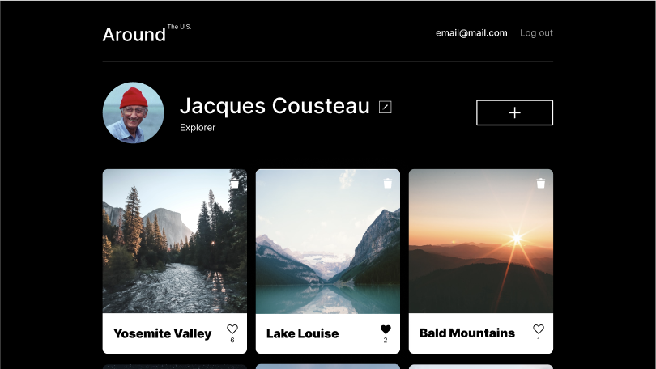
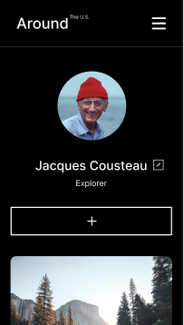
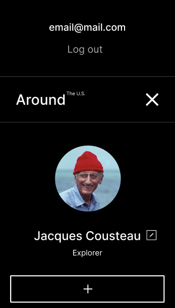

# Around the US!
> A portfolio project featuring user authentication

Link to live site: "http://danny-around-react.students.nomoreparties.site"

This application features user authentication through popular and highly scalable "token authentication" through localStorage. Users can create cards and add public images, which are stored on a custom configured server hosted on AWS Lightsail. Users can also like cards, remove likes, delete cards, and edit their own profile details.



It also features responsive design and a hamburger icon with a mobile navigation menu.

Mobile closed:  



Mobile open:  




## Installation

After clone, make sure you have node.js installed. Then navigate to the backend directory and run:

```sh
npm install
```

Then run:

```sh
node app
```

Navigate to the front end directory. Run:

```sh
npm install
```

Then:

```sh
npm run start
```


## Development setup

THIS IS THE DEVELOPMENT VERSION (NOT COMPILED). PRODUCTION BUILD IS ON THE "deployment-branch". Only difference is that the FETCH requests are directed at localhost rather than the remote server. Remote server will reject any requests made from localhost as part of its CORS policy.

## NOTE:

DO NOT REGISTER USING ANY SENSITIVE DATA

This is a portfolio project built for demonstration purposes only and is NOT secured. By default, the server allows all requests from localhost:3000, so anyone with an active development server can access it.


## Meta

Daniel Gummow (dannydemosi) – [@LinkedIn](https://www.linkedin.com/in/daniel-gummow-223043186/) – rdgummow@gmail.com

[Github](https://github.com/ddemosi/)